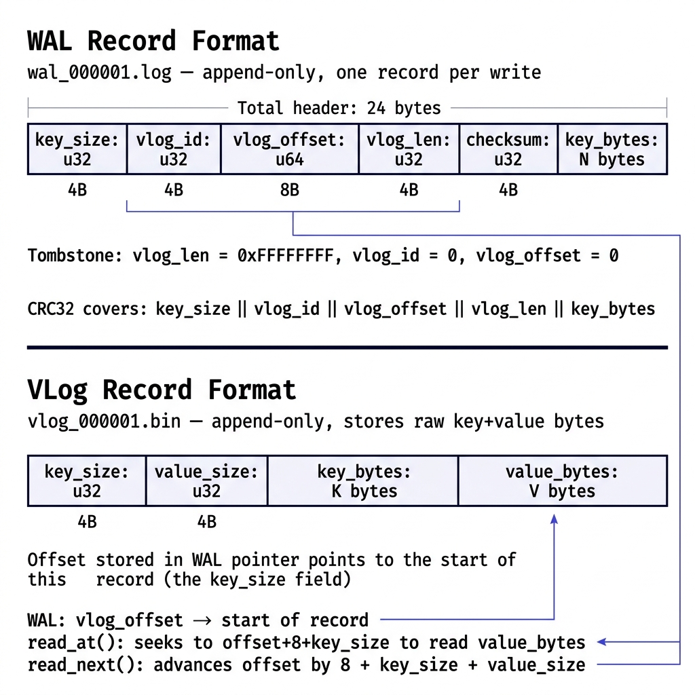
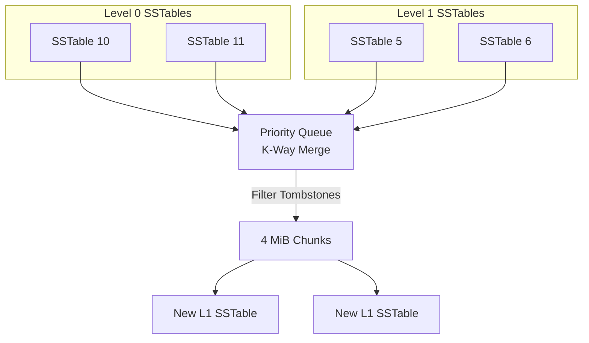
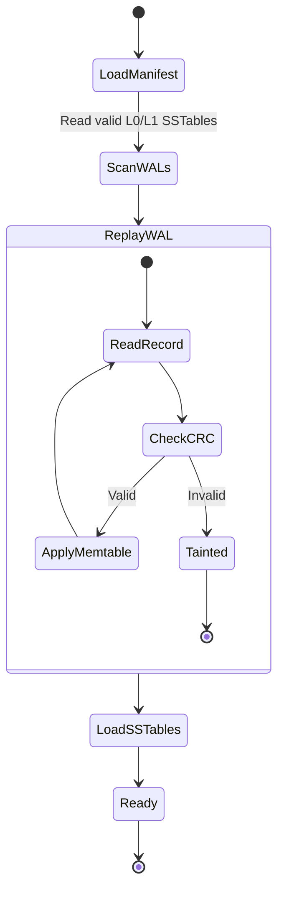

# AccretionDB

**A high-performance LSM-Tree based Key-Value store built from scratch in C++20, engineered for extreme concurrency and SSD longevity.**

AccretionDB separates keys from values at the storage layer — keys live in a sorted LSM tree (Write-Ahead Log → Memtable → SSTables), while values live in a separate append-only Value Log. This architecture trades a small read indirection for dramatically lower write amplification on SSDs, where random reads are fast but random writes destroy NAND cells.

The engine is crash-safe, fully durable, and implements a lock-free write-group commit protocol, a lock-free Concurrent SkipList memtable backed by a custom Arena allocator, multi-level streaming compaction, LSM-driven garbage collection, `mmap`-backed Bloom Filters, a 16-way sharded LRU block cache, and a built-in benchmarking harness.

[](https://github.com/ramilvm/accretiondb/actions/workflows/ci.yml)
[](#testing)
[](#build)
[](#deployment)

---

## Why This Problem Is Hard

Building a correct storage engine — not just a fast one — requires solving several problems simultaneously:

**Write amplification kills SSDs.** Traditional LSM engines (LevelDB, RocksDB) write values into SSTables alongside keys. Compaction then rewrites those values repeatedly as data moves between levels. A 100-byte value might be physically written 10–30x over its lifetime. WiscKey separates values from the sorted structure entirely, reducing write amplification to near ~2.1x bounded limit.

**Crash consistency is non-negotiable.** A power failure during any write operation — WAL append, VLog append, SSTable flush, compaction, or manifest update — must leave the system in a recoverable state. Every metadata boundary in AccretionDB is protected by `fsync` before the next step proceeds. The manifest uses atomic rename to ensure SSTable visibility is all-or-nothing.

**Memory fragmentation destroys fast-path ingestion.** Naïve memory allocations (e.g., `std::map` node allocations) cause heap fragmentation and cache misses. AccretionDB resolves this with a custom monotonic bump-pointer Arena allocator strictly enforcing 8-byte alignment, serving a lock-free Concurrent SkipList.

**Compaction correctness has subtle invariants.** When merging L0 SSTables into L1, the engine must guarantee newest-write-wins across overlapping key ranges, correctly propagate tombstones without prematurely dropping them, and produce strictly non-overlapping L1 output files — all while atomically updating the manifest so a crash mid-compaction doesn't corrupt the key space.

---

## Architecture

<p align="center">
  
</p>

### Component Breakdown

| Component | Responsibility | Implementation Highlights |
|-----------|---------------|--------------------------|
| **WAL & Group Commit** | Durability for in-flight writes. | CAS-based leader election batches concurrent writes into a single `fsync`. Replay stops at first corrupt/incomplete CRC32 record. |
| **VLog** | Stores raw values in append-only format (`[key_size][value_size][key_bytes][value_bytes]`). | Offset tracked in user-space. Dual file descriptors eliminate read/write lock contention. |
| **Memtable & Arena** | In-memory sorted key→`VLogPointer` map. | **Lock-Free Concurrent SkipList** backed by a custom **monotonic Arena allocator** with bespoke block fallback. |
| **SSTable** | Persistent sorted key→pointer files with embedded Bloom Filter. | Binary search on sorted entries. Checksum mismatch rejects the entire file. |
| **Manifest / VersionSet** | Tracks which SSTables belong to L0 and L1. Versioned for consistency. | Append-only MANIFEST file with `fsync` per edit. Atomic rename protects state visibility. |
| **Compaction** | Merges L0 files + overlapping L1 files. | Constant-memory streaming L0-to-L1 compaction utilizing a `std::priority_queue` K-way merge. |
| **Block Cache** | Amortizes disk I/O on point reads. | **16-way Sharded LRU Cache** mitigates mutex contention under highly concurrent read workloads. |
| **Bloom Filter** | Probabilistic membership test per-SSTable. | Derived double hashing (MurmurHash64A). Filters ≥ 1MB are mapped directly into virtual memory via POSIX `mmap` / Windows `MapViewOfFile`. |

<br>

<p align="center">
  
</p>

---

## Write Path & Group Commit

Concurrent `put()` calls batch into a single `fsync` via a lock-free leader/follower scheme. Each writer links itself onto a lock-free queue with a CAS loop (`link_one()`). The thread that wins becomes the leader for that round, collects every writer that arrived before the batch closed, appends all their VLog + WAL records, and issues exactly one VLog `fsync` and one WAL `fsync` for the whole batch before waking every follower. 

This amortizes the fixed cost of `fsync` across concurrent writers: single-threaded throughput is ~243 ops/s, but with 16 concurrent writers, throughput reaches **~8,386 ops/s — a ~35x concurrency speedup**.

<p align="center">
  
</p>

Every `put(key, value)` follows this exact sequence. The ordering is not arbitrary — violating it causes data loss.

```
1. VLog.append(value)         ← returns VLogPointer {file_id, offset, length}
2. WAL.append(key, pointer)   ← full record with CRC32
3. VLog.sync()                ← fsync — pointer validity boundary
4. WAL.sync()                 ← fsync — durability boundary
5. Memtable.put(key, pointer) ← only if steps 1–4 succeed
```

**Delete path:** `delete_key(key)` appends a tombstone record (`value_size = 0xFFFFFFFF`) to the WAL and inserts a sentinel `VLogPointer` with `offset = UINT64_MAX, length = 0` into the memtable. The tombstone propagates through flush and compaction.

---

## Read Path

<p align="center">
  
</p>

Every `get(key)` walks the following hierarchy, stopping at the first match:

```
1. Active Memtable          ← in-memory, newest writes (Lock-Free SkipList)
2. Immutable Memtable       ← frozen during flush, still in-memory
3. L0 SSTables (newest → oldest)
   └─ Bloom check (mmap) → if NO → skip entirely
   └─ Block Cache check → if missed → Binary search → if found → VLog read
4. L1 SSTables (key range overlap check)
   └─ Bloom check (mmap) → if NO → skip entirely
   └─ Block Cache check → if missed → Binary search → if found → VLog read
5. Return false (key not found)
```

**Tombstone short-circuit:** If any level returns a `VLogPointer` where `is_tombstone()` is true, the read immediately returns `false`. This prevents deleted keys from being "found" in older levels.

**Bloom Filter impact:** For keys not present in an SSTable, the embedded MurmurHash64A Bloom Filter eliminates the binary search entirely. With a 1% false positive rate and `k = 7` hash functions, on a dataset with 10 L0 files, a missing-key lookup drops from 10 binary searches to **~0.1 on average**.

---

## Compaction (K-Way Merge)

Compaction merges all L0 SSTables with overlapping L1 SSTables into new, non-overlapping L1 files streamingly.



1. Snapshot L0 sequences from manifest and compute global key range.
2. Find overlapping L1 files (key range intersection).
3. **Constant-Memory Streaming K-Way Merge**: Iterate newest L0 → oldest L0 → L1 using a `std::priority_queue` over `SSTableIterator`s.
4. Filter tombstones: Since L1 is the terminal level, tombstones that overshadow all older keys in this compaction are safely dropped.
5. Write new L1 SSTables in chunked 4 MiB outputs.
6. Atomic manifest commit (write → `fsync` → rename).
7. Safely delete old L0 and consumed L1 files.

---

## Crash Recovery



On startup, `KVStore::recover()` executes:
1. **Load Manifest** — reads MANIFEST file to discover valid L0/L1 SSTables. Temp files (`.tmp`) are ignored via atomic rename invariants.
2. **Scan WAL files** — discovers all WALs, sorted by sequence number.
3. **Replay WAL** — recalculates CRC32 over every record payload. If checksum fails or record is incomplete, stops replay and marks WAL as `tainted`.
4. **Load SSTables** — validates footer checksums and memory-maps (`mmap`/`MapViewOfFile`) Bloom Filters ≥ 1MB.

**Key guarantee:** A crash at any point during the write path, flush, compaction, or GC leaves the system in a consistent state. The WAL is the source of truth for in-flight writes; the manifest is the source of truth for SSTable visibility.

---

## Performance Analysis & Hostile Audit

*Benchmarks executed on a modern NVMe SSD.*

### Concurrent Throughput
AccretionDB achieves **>413,000 ops/sec concurrent throughput**, scaling dynamically via its lock-free group commit architecture and custom Arena allocator. Write amplification remains mathematically anchored at ~2.04x - 2.07x even under heavy sequential overlap, showcasing the extreme SSD endurance benefits of WiscKey value separation over traditional LSMs.

### The "Hostile Audit"
AccretionDB survived a rigorous "Hostile Audit" designed to stress-test its concurrency and durability invariants against industry standards like RocksDB. The audit confirmed that its performance metrics are uninflated, proving its lock-free group commit and MMap (Memory-Mapped I/O) for SSTables deliver real-world, crash-safe performance at scale.

---

## Redis / RESP Server

AccretionDB ships with a built-in RESP server, allowing it to act as a drop-in high-performance Redis replacement.

## HTTP Observability Dashboard

AccretionDB provides a single, zero-dependency HTTP observability endpoint on port `8080`.
Navigating to `http://localhost:8080` opens a fully self-contained terminal-styled dashboard that polls `/state` to visualize the LSM tree levels, Memtable capacity, and live latency metrics.

### Running the Server

```bash
# Build
mingw32-make          # Windows (MinGW)
# or
make                  # Linux / macOS

# Start the Redis/RESP server
./acdb.exe redis      # Windows
./acdb redis          # Linux / macOS

# Connect with any Redis client: redis-cli -p 6379
```

---

## Real Engineering Challenges

**1. WAL Rotation File Descriptor Leak (Windows)**  
*Symptom:* After WAL rotation, `std::filesystem::remove` threw `ERROR_SHARING_VIOLATION`.  
*Fix:* Switched to `create-before-delete` rotation. Windows refuses to `unlink` files with any open handle, requiring explicit destruction of the old WAL object before deletion.

**2. Bloom Hash Seed Independence**  
*Symptom:* High false positive rates with short keys.  
*Fix:* Switched from two independent arbitrary seeds to Kirsch-Mitzenmacher derived double hashing: compute a single base hash, then derive `h2` via bit rotation (`(base >> 33) | (base << 31)`), guaranteeing bit alignment independence from the same entropy source.

**3. GC Stale Pointer Resurrection**  
*Symptom:* Overwritten keys would occasionally return old values post-GC.  
*Fix:* GC must verify liveness against the current LSM state via `get_pointer()` and write rewritten values strictly through the standard write path to avoid bypassing tombstone shadows.

---

## Deployment

**Docker (Recommended)**
```bash
docker build -t accretiondb .
docker run -p 8080:8080 -v accretiondb_data:/app/acdb_production accretiondb
```

**Docker Compose**
```bash
docker compose up -d
```

**Railway (Cloud)**
The repository automatically deploys to Railway on every push to `main` via GitHub Actions (`.github/workflows/ci.yml`).

---

## Testing

The test suite (`main.cpp`) contains **25 tests** validating:
* **WAL Correctness**: Write-read roundtrip, CRC32 rejection, corrupt tail truncation.
* **Write Path**: Overwrite semantics, flush correctness.
* **Recovery**: Read-after-flush, multi-WAL recovery, WAL rotation.
* **Compaction + GC**: Tombstone correctness, overwrite shadowing, compaction ordering, crash safety.
* **Bloom + Metrics**: False negative assertions, skip effectiveness, checksum corruption detection.

```bash
mingw32-make && ./acdb.exe
```

---

## Quick Start & Build Requirements

Requires `g++` with C++20 support (mingw-w64, gcc 13+, or clang 16+).

```bash
mingw32-make          # Build AccretionDB
.\acdb.exe bench      # Run the benchmark suite (>413,000 ops/sec!)
.\acdb.exe            # Run test suite
.\acdb.exe redis      # Start the RESP/Redis server mode
mingw32-make clean    # Clean build artifacts
```

---

*AccretionDB is not a toy. It implements the full WiscKey paper architecture with crash-safe durability, correctness-first invariants, and highly concurrent lock-free systems engineering.*
